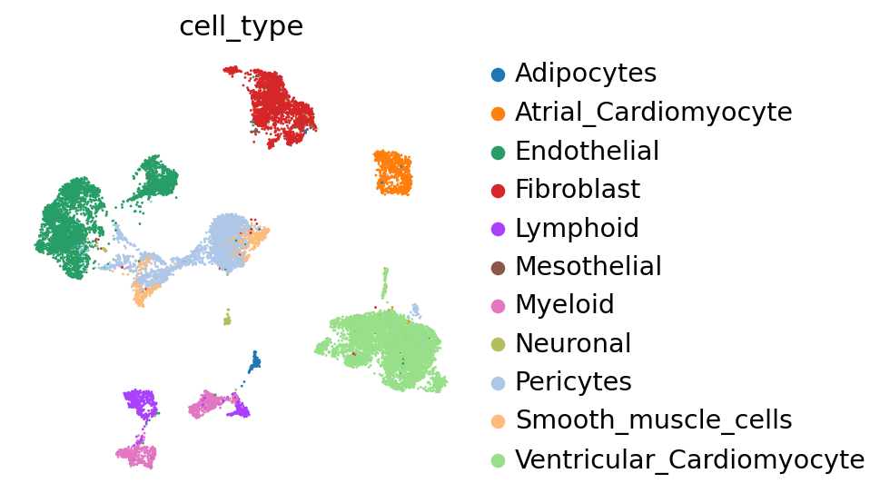
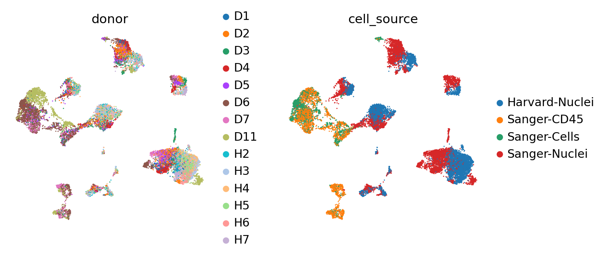
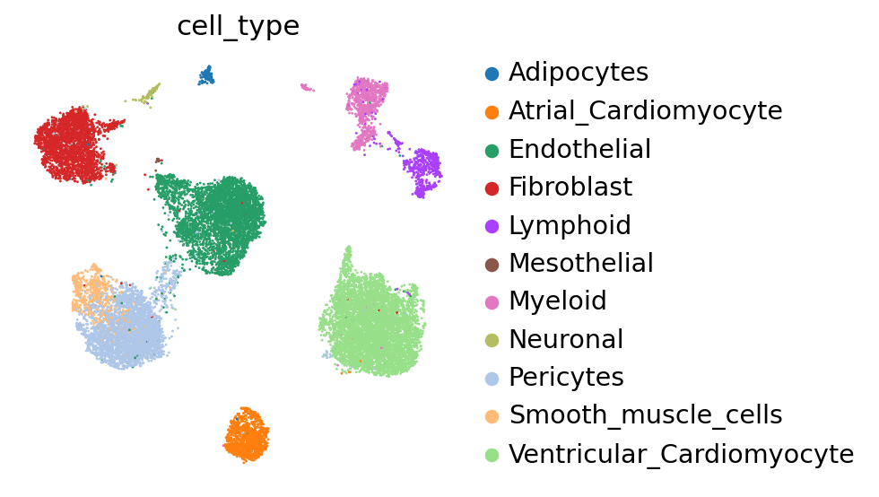
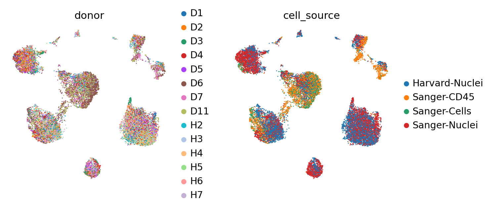

## Demonstration of scvi-tools
This tutorial follows the workflow in:

https://docs.scvi-tools.org/en/stable/tutorials/notebooks/api_overview.html

Check https://docs.scvi-tools.org for more tutorials on using different models on a variety of single-cell analysis tasks.


### Library loading and  preprocessing

```r
reticulate::use_condaenv("day4_deep_generative_networks")
reticulate::py_config()
```


```{.python .pythonchunk}
import scvi
import scanpy as sc
import matplotlib
import matplotlib.pyplot as plt
plt.switch_backend('agg')
matplotlib.use("Agg", force=True)
sc.set_figure_params(figsize=(4, 4))

# All scvi-tools models require AnnData objects as input.
adata = scvi.data.heart_cell_atlas_subsampled()

# Preprocess the data to remove, for example, genes that are very lowly expressed and other outliers using scanpy
sc.pp.filter_genes(adata, min_counts=3)

# Unless otherwise specified, scvi-tools models require the raw counts (not log library size normalized). Here we just store the normalized data separately.
adata.layers["counts"] = adata.X.copy() # preserve counts
sc.pp.normalize_total(adata, target_sum=1e4)
sc.pp.log1p(adata)
adata.raw = adata # freeze the state in `.raw`

# Perform feature selection
sc.pp.highly_variable_genes(
  adata,
  n_top_genes=1200,
  subset=True,
  layer="counts",
  flavor="seurat_v3",
  batch_key="cell_source"
)
```


### Setup annotation

Run setup_anndata(), which alerts scvi-tools to the locations of various matrices inside the anndata. It’s important to run this function with the correct arguments so scvi-tools is notified that your dataset has batches, annotations, etc. For example, if batches are registered with scvi-tools, the subsequent model will correct for batch effects. See the full documentation for details.

In this dataset, there is a “cell_source” categorical covariate, and within each “cell_source”, multiple “donors”, “gender” and “age_group”. There are also two continuous covariates we’d like to correct for: “percent_mito” and “percent_ribo”. These covariates can be registered using the categorical_covariate_keys argument. If you only have one categorical covariate, you can also use the batch_key argument instead.


```{.python .pythonchunk}

scvi.model.SCVI.setup_anndata(
    adata,
    layer="counts",
    categorical_covariate_keys=["cell_source", "donor"],
    continuous_covariate_keys=["percent_mito", "percent_ribo"]
)

```


### Creating and training the model

While we highlight the scVI model here, the API is consistent across all scvi-tools models.


```{.python .pythonchunk}

model = scvi.model.SCVI(adata)

# We can see an overview of the model by printing it:
model

# Train the model. This is quite slow in the absence of GPUs:
# model.train(max_epochs=400)

# Save the trained model:
# model.save("/home/rstudio/workdir/adv_singlecell_2022/day4_deep_generative_networks/trained_models/scvi_model/")

# Load a trained model:
model = scvi.model.SCVI.load("/home/rstudio/workdir/adv_singlecell_2022/day4_deep_generative_networks/trained_models/scvi_model/", adata=adata, use_gpu=False)

```


### Obtaining model outputs


```{.python .pythonchunk}


latent = model.get_latent_representation()

#It’s often useful to store the outputs of scvi-tools back into the original anndata, as it permits interoperability with Scanpy: 
adata.obsm["X_scVI"] = latent

# Obtain the latent representation for a subset of the data:
adata_subset = adata[adata.obs.cell_type == "Fibroblast"]
latent_subset = model.get_latent_representation(adata_subset)

# Obtain the denoised output for a subset of the data subset:
denoised = model.get_normalized_expression(adata_subset, library_size=1e4)
denoised.iloc[:5, :5]


# store the denoised normalized values back in the anndata
adata.layers["scvi_normalized"] = model.get_normalized_expression(
    library_size=1e4
)
```


### Visualization 


```{.python .pythonchunk}
#First, we demonstrate the presence of nuisance variation with respect to nuclei/whole cell, age group, and donor by plotting the UMAP results of the top 30 PCA components for the raw count data.
# run PCA then generate UMAP plots
sc.tl.pca(adata)
sc.pp.neighbors(adata, n_pcs=30, n_neighbors=20)
sc.tl.umap(adata, min_dist=0.3)

sc.pl.umap(
    adata,
    color=["cell_type"],
    frameon=False,
)
sc.pl.umap(
    adata,
    color=["donor", "cell_source"],
    ncols=2,
    frameon=False,
)
```





```{.python .pythonchunk}
# Now we use scVI latent space for UMAP generation to check if scVI successfully accounts for batch effects in the data.

# use scVI latent space for UMAP generation
sc.pp.neighbors(adata, use_rep="X_scVI")
sc.tl.umap(adata, min_dist=0.3)

sc.pl.umap(
    adata,
    color=["cell_type"],
    frameon=False,
)

sc.pl.umap(
    adata,
    color=["donor", "cell_source"],
    ncols=2,
    frameon=False,
)

```






